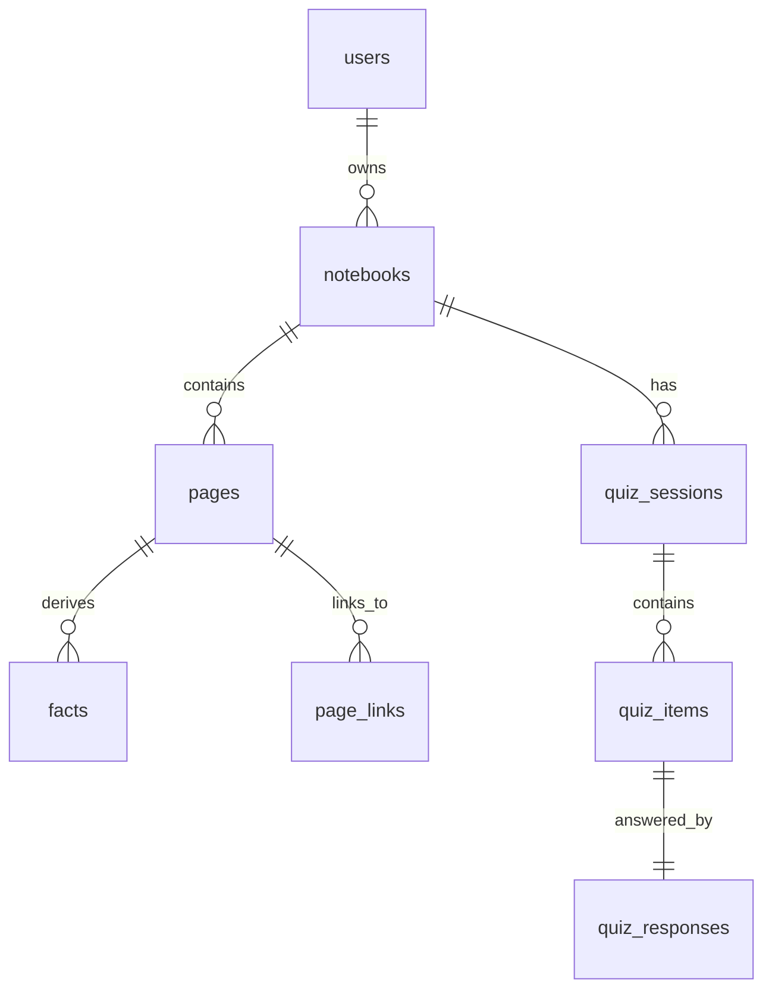

# Recall — v1 Product & Technical Specification

> **Goal**: Recall helps users commit knowledge to long‑term memory by turning personal notes (markdown pages) into atomic *facts* that are reviewed via spaced repetition.
>
> v1 focuses on: simplicity, correctness, and a clean mental model — not scalability or polish.

---

## 1. Core Concepts

### 1.1 Notebook

* A **Notebook** is a top‑level container owned by a user.
* A user may have multiple notebooks.
* All pages, facts, and quizzes belong to exactly one notebook.

### 1.2 Page

* A **Page** is a markdown (`.md`) document authored inside Recall.
* Pages can link to other pages using standard markdown links.
* Pages are versioned implicitly via `updated_at` (no full history in v1).

### 1.3 Fact

* A **Fact** is an *atomic claim* derived from a page.
* Facts are strictly **page‑scoped** (no cross‑page deduplication).
* Facts are automatically extracted using an LLM.
* Facts are the unit of spaced repetition.

Examples of facts:

* A definition
* A relationship (X causes Y)
* A short list
* A procedural step

### 1.4 Fact Types

Facts have a `type` enum:

* `generic` (fallback)
* `definition`
* `relationship`
* `procedure`
* `list`

Types do not affect behavior in v1, but are stored for future use.

---

## 2. Page → Fact Extraction

### 2.1 When Extraction Happens

* Extraction runs **automatically on page save**.
* There is no manual approval step in v1.

### 2.2 Extraction Strategy

* The full page markdown is sent to the LLM.
* The LLM outputs a list of facts, each with:

  * question
  * answer
  * type
  * source text span (line range)

Quality > quantity. There is no target number of facts.

### 2.3 Fact Identity & Stability

Facts are matched across page updates to preserve scheduling state.

Each fact stores:

* `source_start_line`
* `source_end_line`
* `source_quote` (exact or normalized snippet)
* `source_hash` (hash of `source_quote`)

On page update:

1. A diff is computed using a **line‑based diff library**.
2. For each existing fact:

   * If its source lines were untouched → fact remains unchanged.
   * If its source lines intersect changed hunks:

     * Send updated context to LLM:

       * *"Is this fact still accurate and sufficiently complete given the new content?"*
     * If **yes** → update line numbers, keep fact + SRS state.
     * If **no** → re‑extract facts from the affected region.

This avoids re‑extracting the entire page unnecessarily.

### 2.4 Overlapping Facts

* When re‑extracting from a region, newly extracted facts are matched against existing ones by similarity.
* Matched facts update in place.
* Unmatched old facts are soft‑deleted.

---

## 3. Spaced Repetition System (SRS)

### 3.1 Ladder (Fibonacci)

```
Level:   0  1  2  3  4  5   6   7   8   9   10  11
Days:    1, 2, 3, 5, 8, 13, 21, 34, 55, 89, 144, 233
```

* Max level = 11 (233 days).

### 3.2 Fact Scheduling Fields

Each fact stores:

* `srs_level` (int)
* `next_scheduled_at` (timestamp)
* `last_reviewed_at` (timestamp)

### 3.3 Scheduler Rules

```pseudo
if final_grade == CORRECT:
  srs_level = min(srs_level + 1, MAX_LEVEL)
else:
  srs_level = 0

next_scheduled_at = now + FIBONACCI[srs_level]
```

* Any non‑correct grade resets the fact to level 0.
* Scheduling uses **absolute timestamps**, not relative days.

---

## 4. Quizzes

### 4.1 Quiz Session

A **Quiz Session** represents one review session.

Types:

* `scheduled` — all facts where `next_scheduled_at <= now`
* `manual_page` — all facts from a selected page
* `manual_random` — random facts from notebook

Users may optionally cap the number of questions (`N`).

### 4.2 Quiz Items

* Each quiz item corresponds to **one fact**.
* For scheduled quizzes, a **new question is generated every time**.

Stored per quiz item:

* `generated_question_text`
* `canonical_answer_snapshot`

### 4.3 Answering & Grading

Answer flow:

1. User answers in plain English.
2. LLM evaluates answer vs canonical answer.
3. LLM outputs:

   * grade: `incorrect | incomplete | partially_correct | correct`
   * confidence score
   * rationale
4. User may override the grade after quiz completion.

### 4.4 Grade Effects

* **Scheduled quizzes** affect SRS after final (human‑corrected) grade.
* **Manual quizzes** never affect SRS.
* All answers are recorded for analytics.

---

## 5. Data Model

### 5.1 ER Diagram



### 5.2 Tables (Key Fields)

#### users

* id
* email
* created_at

#### notebooks

* id
* user_id
* title

#### pages

* id
* notebook_id
* title
* slug
* body_md
* created_at
* updated_at

#### facts

* id
* page_id
* type
* question
* answer
* srs_level
* next_scheduled_at
* last_reviewed_at
* source_start_line
* source_end_line
* source_quote
* source_hash
* needs_review
* created_at
* updated_at

#### quiz_sessions

* id
* notebook_id
* mode
* scope_page_id (nullable)
* created_at
* finished_at

#### quiz_items

* id
* quiz_session_id
* fact_id
* generated_question_text
* canonical_answer_snapshot

#### quiz_responses

* id
* quiz_item_id
* response_text
* llm_grade
* final_grade
* llm_confidence
* corrected_by_user
* created_at

#### page_links

* from_page_id
* to_page_id

---

## 6. Page Linking

* Standard markdown links are supported.
* Internal links are parsed on save.
* Parsed links populate `page_links` for backlinks and graph features.

---

## 7. Auth & Multi‑User

* Auth via Google OAuth.
* All data is user‑scoped.
* No sharing or multiplayer features in v1.

---

## 8. LLM Usage Boundaries

LLM is used for:

* Fact extraction
* Question generation
* Answer grading
* Fact validity checks after edits

LLM is **not** used as a source of truth.
Canonical answers are always user‑authored.

---

## 9. Tech Stack (v1)

* Next.js (App Router)
* PostgreSQL (Neon)
* Drizzle ORM
* Zod schemas
* Google OAuth
* Line‑based diff library for page updates

---

## 10. Explicit Non‑Goals (v1)

* Mobile app
* Notifications
* Fact editing UI
* Human approval queues
* Offline support
* Cross‑page fact deduplication

---

## 11. Future Ideas (Out of Scope)

* Wikipedia page ingestion
* Fact summaries / flows
* Difficulty‑aware scheduling
* Mindmap visualization
* Notifications
* Manual fact authoring

---

**End of v1 Spec**
