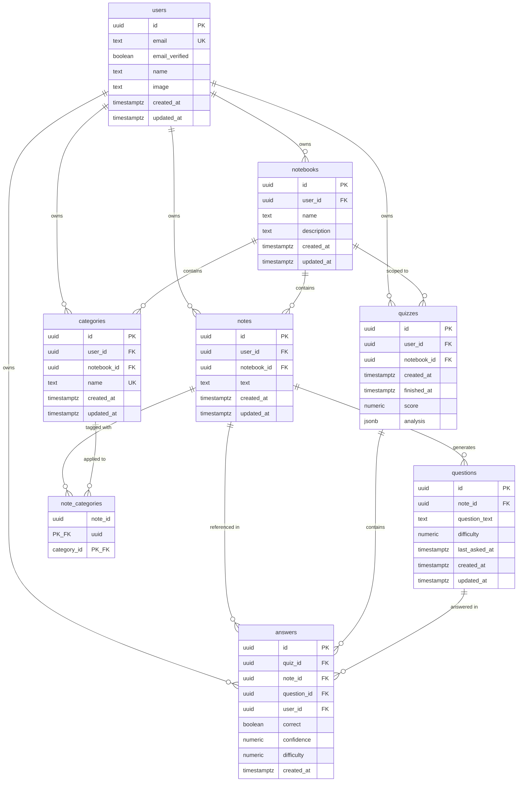
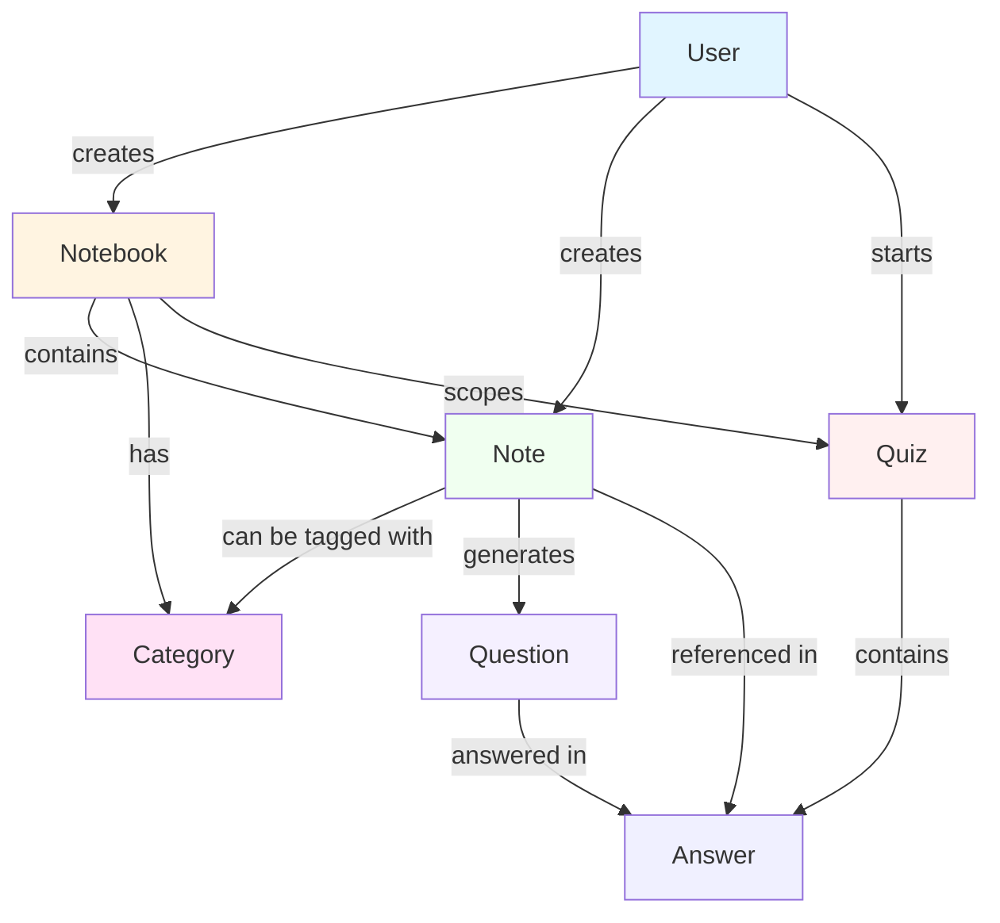

# Recall Data Model

This document provides a comprehensive overview of the Recall application's database schema and relationships.

## Entity Relationship Diagram

## Data Flow Diagram

## Relationship Details

### Core Ownership
- **Users → Notebooks**: One-to-many. Each user can create multiple notebooks.
- **Users → Notes**: One-to-many. Each user owns their notes.
- **Users → Categories**: One-to-many. Each user owns their categories.
- **Users → Questions**: One-to-many (via notes). Questions inherit ownership through their parent note.
- **Users → Quizzes**: One-to-many. Each user creates their own quizzes.
- **Users → Answers**: One-to-many. Each user records their own answers.

### Notebook Organization
- **Notebooks → Notes**: One-to-many. Each notebook contains multiple notes.
- **Notebooks → Categories**: One-to-many. Each notebook can have multiple categories.
- **Notebooks → Quizzes**: One-to-many. Each quiz is scoped to a specific notebook.

### Note Categorization
- **Notes ↔ Categories**: Many-to-many via `note_categories` join table.
  - A note can belong to zero or more categories.
  - A category can contain zero or more notes.
  - Both note and category must belong to the same notebook.

### Quiz System
- **Notes → Questions**: One-to-many. Each note can generate multiple questions over time.
- **Quizzes → Answers**: One-to-many. Each quiz contains multiple answers.
- **Questions → Answers**: One-to-many. Each question can be answered multiple times across different quizzes.
- **Notes → Answers**: One-to-many. A note can be referenced in multiple answers (via questions).

## Field Descriptions

### users
- **id** (UUID, PK): Unique identifier, managed by BetterAuth
- **email** (TEXT, UNIQUE): User's email address
- **email_verified** (BOOLEAN): Email verification status
- **name** (TEXT): User's display name (optional)
- **image** (TEXT): Profile image URL (optional)
- **created_at** (TIMESTAMPTZ): Account creation timestamp
- **updated_at** (TIMESTAMPTZ): Last update timestamp

### notebooks
- **id** (UUID, PK): Unique identifier
- **user_id** (UUID, FK): Owner of the notebook
- **name** (TEXT): Notebook name
- **description** (TEXT): Optional description
- **created_at** (TIMESTAMPTZ): Creation timestamp
- **updated_at** (TIMESTAMPTZ): Last update timestamp

### notes
- **id** (UUID, PK): Unique identifier
- **user_id** (UUID, FK): Owner of the note
- **notebook_id** (UUID, FK): Parent notebook
- **text** (TEXT): Note content
- **created_at** (TIMESTAMPTZ): Creation timestamp
- **updated_at** (TIMESTAMPTZ): Last update timestamp

### categories
- **id** (UUID, PK): Unique identifier
- **user_id** (UUID, FK): Owner of the category
- **notebook_id** (UUID, FK): Parent notebook
- **name** (TEXT): Category name (unique within notebook)
- **created_at** (TIMESTAMPTZ): Creation timestamp
- **updated_at** (TIMESTAMPTZ): Last update timestamp

### note_categories
- **note_id** (UUID, PK/FK): References notes.id
- **category_id** (UUID, PK/FK): References categories.id
- Composite primary key ensures no duplicate associations

### questions
- **id** (UUID, PK): Unique identifier
- **note_id** (UUID, FK): Source note (ownership derived via note.user_id)
- **question_text** (TEXT): The question text
- **difficulty** (NUMERIC 0-1): Question difficulty rating
- **last_asked_at** (TIMESTAMPTZ): Last time this question was asked (optional)
- **created_at** (TIMESTAMPTZ): Creation timestamp
- **updated_at** (TIMESTAMPTZ): Last update timestamp

### quizzes
- **id** (UUID, PK): Unique identifier
- **user_id** (UUID, FK): Quiz creator
- **notebook_id** (UUID, FK): Scope of the quiz
- **created_at** (TIMESTAMPTZ): Quiz start timestamp
- **finished_at** (TIMESTAMPTZ): Quiz completion timestamp (null if unfinished)
- **score** (NUMERIC): Final quiz score
- **analysis** (JSONB): Detailed quiz analysis and insights

### answers
- **id** (UUID, PK): Unique identifier
- **quiz_id** (UUID, FK): Parent quiz
- **note_id** (UUID, FK): Referenced note
- **question_id** (UUID, FK): Specific question answered
- **user_id** (UUID, FK): User who answered
- **correct** (BOOLEAN): Whether the answer was correct
- **confidence** (NUMERIC 0-1): User's confidence rating (optional)
- **difficulty** (NUMERIC 0-1): Question difficulty at time of answer (optional)
- **created_at** (TIMESTAMPTZ): Answer timestamp

## Key Constraints

### Uniqueness
- `users.email`: Unique email addresses
- `categories(notebook_id, name)`: Unique category names per notebook

### Cascades
All foreign keys use `ON DELETE CASCADE`:
- Deleting a user removes all their notebooks, notes, categories, questions, quizzes, and answers
- Deleting a notebook removes all its notes, categories, and quizzes
- Deleting a note removes associated questions, note_categories, and answers
- Deleting a category removes note_categories associations
- Deleting a quiz removes all its answers
- Deleting a question removes associated answers

### Indexes
- All `user_id` columns indexed with `created_at desc` for fast user-scoped queries
- All `notebook_id` columns indexed for fast notebook-scoped queries
- Foreign key columns indexed for fast joins
- Composite indexes for common query patterns (e.g., notebook + finished_at for active quizzes)

## Common Query Patterns

1. **Get user's notebooks**: `notebooks WHERE user_id = ? ORDER BY created_at DESC`
2. **Get notebook's notes**: `notes WHERE notebook_id = ? ORDER BY created_at DESC`
3. **Get note's categories**: Join `note_categories` and `categories` on `category_id`
4. **Get active quiz**: `quizzes WHERE notebook_id = ? AND finished_at IS NULL`
5. **Get quiz answers**: `answers WHERE quiz_id = ?`
6. **Get question history**: `answers WHERE question_id = ? ORDER BY created_at DESC`

