# Database ERD Documentation

## Overview

This document describes the database schema for the Recall application using Drizzle ORM and PostgreSQL.

## Naming Conventions

- **Table names**: Plural snake_case (e.g., `notes`, `notebooks`, `note_categories`)
- **Column names**: snake_case (e.g., `created_at`, `user_id`)
- **Primary keys**: `id` as `uuid` default `gen_random_uuid()`
- **Timestamps**: `created_at` and `updated_at` (`timestamptz`), server-updated
- **Foreign keys**: `*_id` columns with `ON DELETE CASCADE` where owned
- **Ownership**: `user_id` on user-owned rows; row-level access enforced in app layer

## Entity Relationship Diagram

```mermaid
erDiagram
    users ||--o{ notebooks : owns
    users ||--o{ notes : owns
    users ||--o{ categories : owns
    users ||--o{ questions : owns
    users ||--o{ quizzes : owns
    users ||--o{ answers : owns
    
    notebooks ||--o{ notes : contains
    notebooks ||--o{ categories : contains
    notebooks ||--o{ quizzes : contains
    
    notes ||--o{ questions : generates
    notes ||--o{ note_categories : "has many"
    notes ||--o{ answers : references
    
    categories ||--o{ note_categories : "has many"
    
    quizzes ||--o{ answers : contains
    questions ||--o{ answers : referenced_in
    
    users {
        uuid id PK
        text email UK
        boolean email_verified
        text name
        text image
        timestamptz created_at
        timestamptz updated_at
    }
    
    notebooks {
        uuid id PK
        uuid user_id FK
        text name
        text description
        timestamptz created_at
        timestamptz updated_at
    }
    
    notes {
        uuid id PK
        uuid user_id FK
        uuid notebook_id FK
        text text
        timestamptz created_at
        timestamptz updated_at
    }
    
    categories {
        uuid id PK
        uuid user_id FK
        uuid notebook_id FK
        text name
        timestamptz created_at
        timestamptz updated_at
    }
    
    note_categories {
        uuid note_id PK,FK
        uuid category_id PK,FK
    }
    
    questions {
        uuid id PK
        uuid note_id FK
        uuid user_id FK
        text question_text
        numeric difficulty
        timestamptz last_asked_at
        timestamptz created_at
        timestamptz updated_at
    }
    
    quizzes {
        uuid id PK
        uuid user_id FK
        uuid notebook_id FK
        timestamptz created_at
        timestamptz finished_at
        numeric score
        jsonb analysis
    }
    
    answers {
        uuid id PK
        uuid quiz_id FK
        uuid note_id FK
        uuid question_id FK
        uuid user_id FK
        boolean correct
        numeric confidence
        numeric difficulty
        timestamptz created_at
    }
```

## Table Descriptions

### users
Managed by BetterAuth. Contains user authentication and profile information.

- `id`: Primary key (UUID)
- `email`: Unique email address
- `email_verified`: Whether email is verified
- `name`: User's display name
- `image`: Profile image URL
- `created_at`: Account creation timestamp
- `updated_at`: Last update timestamp

### notebooks
User-created containers for organizing notes.

- `id`: Primary key (UUID)
- `user_id`: Foreign key to users (owner)
- `name`: Notebook name
- `description`: Optional description
- `created_at`: Creation timestamp
- `updated_at`: Last update timestamp

### notes
Individual notes belonging to a notebook.

- `id`: Primary key (UUID)
- `user_id`: Foreign key to users (owner)
- `notebook_id`: Foreign key to notebooks (parent)
- `text`: Note content
- `created_at`: Creation timestamp
- `updated_at`: Last update timestamp

### categories
User-defined categories within a notebook for organizing notes.

- `id`: Primary key (UUID)
- `user_id`: Foreign key to users (owner)
- `notebook_id`: Foreign key to notebooks (parent)
- `name`: Category name (unique within notebook)
- `created_at`: Creation timestamp
- `updated_at`: Last update timestamp

### note_categories
Many-to-many join table linking notes to categories.

- `note_id`: Foreign key to notes (part of composite PK)
- `category_id`: Foreign key to categories (part of composite PK)

### questions
Questions generated from notes for quizzing.

- `id`: Primary key (UUID)
- `note_id`: Foreign key to notes (source)
- `user_id`: Foreign key to users (owner)
- `question_text`: The question text
- `difficulty`: Difficulty rating (0-1)
- `last_asked_at`: Last time question was asked
- `created_at`: Creation timestamp
- `updated_at`: Last update timestamp

### quizzes
Quiz sessions testing user knowledge.

- `id`: Primary key (UUID)
- `user_id`: Foreign key to users (owner)
- `notebook_id`: Foreign key to notebooks (scope)
- `created_at`: Quiz start timestamp
- `finished_at`: Quiz completion timestamp (null if unfinished)
- `score`: Final quiz score
- `analysis`: JSON analysis data

### answers
Individual answers recorded during quizzes.

- `id`: Primary key (UUID)
- `quiz_id`: Foreign key to quizzes
- `note_id`: Foreign key to notes
- `question_id`: Foreign key to questions
- `user_id`: Foreign key to users (owner)
- `correct`: Whether answer was correct
- `confidence`: User confidence rating (0-1)
- `difficulty`: Question difficulty at time of answer (0-1)
- `created_at`: Answer timestamp

## Indexes

### Performance Indexes
- `notes(user_id, created_at desc)` - Fast user note listing
- `notes(notebook_id, created_at desc)` - Fast notebook note listing
- `notebooks(user_id, created_at desc)` - Fast user notebook listing
- `categories(notebook_id)` - Fast category lookup by notebook
- `categories(notebook_id, lower(name))` - Unique category name per notebook
- `quizzes(user_id, created_at desc)` - Fast user quiz listing
- `quizzes(notebook_id, created_at desc)` - Fast notebook quiz listing
- `quizzes(notebook_id, finished_at nulls first, created_at desc)` - Active quiz lookup
- `answers(quiz_id)` - Fast answer lookup by quiz
- `answers(user_id, created_at desc)` - Fast user answer history
- `answers(question_id, created_at desc)` - Fast question answer history
- `note_categories(category_id)` - Fast note lookup by category
- `note_categories(note_id)` - Fast category lookup by note

## Foreign Key Constraints

All foreign keys use `ON DELETE CASCADE` to automatically clean up related records when a parent is deleted. This ensures data consistency and prevents orphaned records.

## Export Instructions

To export an ERD diagram from the database:

1. Use Drizzle Studio: `pnpm db:studio`
2. Use a database visualization tool like pgAdmin or TablePlus
3. Use a schema visualization tool like dbdiagram.io or draw.io with the Mermaid diagram above

