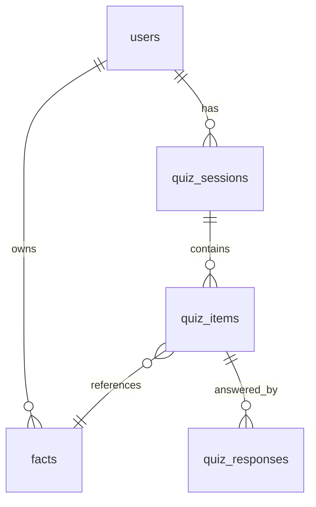

# Recall — v1 Product & Technical Specification

> **Goal**: Recall helps users commit knowledge to long-term memory by entering facts and reviewing them via spaced repetition. The user supplies the information; the AI generates questions and answers for quizzing.
>
> v1 focuses on: simplicity, correctness, and a clean mental model — not scalability or polish.

---

## 1. Core Concepts

### 1.1 User

* A **User** has an account (Google OAuth or email/password).
* All facts and quiz data are scoped to a single user.
* No sharing or multiplayer in v1.

### 1.2 Fact

* A **Fact** is a single piece of information the user wants to remember.
* The user enters **one block of text** (e.g. a definition, a paragraph of explanation). That is the source of truth.
* The system stores:
  * **User content** — the raw text the user entered.
  * **Generated question** — produced by the LLM from the user content (used when quizzing).
  * **Canonical answer** — produced by the LLM from the user content (used for grading).
* Facts live in a **single flat list** per user. No notebooks, no pages, no categories in v1.
* Facts are the unit of spaced repetition.

Example of user content:

> DML stands for Data Manipulation Language, a subset of SQL used to add, retrieve, update, and delete data within database tables. It focuses on managing the data content itself rather than the structure of the database, with core commands being INSERT, SELECT, UPDATE, and DELETE.

The LLM turns that into a question (e.g. "What does DML stand for and what is it used for?") and a canonical answer for grading.

### 1.3 Fact Types

Facts have a `type` enum:

* `generic` (fallback)
* `definition`
* `relationship`
* `procedure`
* `list`

In v1 the default is `generic` and the system does not assign other types yet. Types are stored for future use (e.g. filtering, different question styles).

### 1.4 When Q/A Is Generated

* **On create**: User submits the text → LLM generates question + canonical answer → fact is stored with all three (user content, generated question, canonical answer), and type defaults to `generic`.
* **On edit**: User changes the text and saves → LLM generates new question + canonical answer → stored fields are updated. Whether SRS state is preserved or reset is controlled by the "Keep schedule" option (see Editing facts).

---

## 2. Spaced Repetition System (SRS)

### 2.1 Ladder (Fibonacci)

```
Level:   0  1  2  3  4  5   6   7   8    9    10   11   12
Days:    1, 1, 2, 3, 5, 8, 13, 21, 34,  55,  89, 144, 233
```

* Max level = 11 (233 days).

### 2.2 Fact Scheduling Fields

Each fact stores:

* `srs_level` (int)
* `next_scheduled_at` (timestamp)
* `last_reviewed_at` (timestamp, nullable)

### 2.3 Scheduler Rules

```pseudo
if final_grade == CORRECT:
  srs_level = min(srs_level + 1, MAX_LEVEL)
else:
  srs_level = 0

next_scheduled_at = now + FIBONACCI[srs_level]
```

* Any non-correct grade resets the fact to level 0.
* Scheduling uses **absolute timestamps**, not relative days.
* **Only scheduled quizzes** update these fields. Manual quizzes do not change SRS level or next_scheduled_at.

---

## 3. Quizzes

### 3.1 Quiz Session

A **Quiz Session** represents one review session.

Modes in v1:

* **Manual (random)** — User triggers "Start quiz". System selects up to 10 random facts. If the user has fewer than 10 facts, all are used. Correct/incorrect **does not** change SRS. (If 0 facts, show e.g. "Add some facts first" and do not start a quiz.)
* **Scheduled** — Facts where `next_scheduled_at <= now`. Correct/incorrect **does** change SRS (per Scheduler rules). Implemented in a later gameplan.

### 3.2 Quiz Items

* Each quiz item corresponds to **one fact**.
* Stored per quiz item:
  * `generated_question_text` (snapshot or current from fact)
  * `canonical_answer_snapshot` (from fact at quiz time)

### 3.3 Answering & Grading

1. User answers in plain text.
2. LLM evaluates answer vs canonical answer.
3. LLM outputs: grade (`incorrect | incomplete | partially_correct | correct`), confidence score, rationale.
4. User may override the grade after quiz completion (implemented after both manual and scheduled quiz gameplans are done).

### 3.4 Grade Effects

* **Scheduled quizzes** — Affect SRS after final (human-corrected) grade.
* **Manual quizzes** — Do **not** affect SRS. Answers are still recorded for analytics/history.

---

## 4. Fact Lifecycle

### 4.1 Adding a Fact

* User clicks **Add Fact** (e.g. on the facts list page).
* A modal opens: single text input (multiline) + **Submit** (or **Add**).
* On submit: user content is saved, LLM is called to generate question + canonical answer, then the fact is stored with SRS level 0 and next_scheduled_at set (e.g. now + 1 day). New facts appear in the list.

### 4.2 Editing a Fact

* User can edit the fact's **user content** (the original text).
* UI: **Keep schedule** switch + **Save** button.
  * **Keep schedule ON** — Save updates user content and regenerates question + canonical answer via LLM. SRS level and next_scheduled_at are **unchanged**.
  * **Keep schedule OFF** — Same as above, plus SRS is **reset** (e.g. srs_level = 0, next_scheduled_at = now + 1 day).
* Only one action: Save. Whether schedule is kept is determined by the switch.

### 4.3 Deleting a Fact

* **Hard delete** only. Fact and its SRS/quiz history are removed. No soft delete in v1.

### 4.4 List Order

* Facts are shown in **newest first** order (by creation time). Filtering/sorting options may be added later.

---

## 5. Data Model

### 5.1 ER Diagram



### 5.2 Tables (Key Fields)

#### users

* id
* email (unique)
* password hash (nullable; null if only OAuth)
* name (optional)
* avatar_url (optional)
* created_at

Plus OAuth account/session tables as required by the auth provider (e.g. accounts, sessions, verification_tokens).

#### facts

* id
* user_id
* type — enum: `generic` | `definition` | `relationship` | `procedure` | `list` (default `generic`; unused in v1)
* user_content (text) — raw input from user
* generated_question (text) — LLM-generated
* canonical_answer (text) — LLM-generated
* srs_level
* next_scheduled_at
* last_reviewed_at (nullable)
* created_at
* updated_at

#### quiz_sessions

* id
* user_id
* mode (`manual_random` | `scheduled`)
* created_at
* finished_at (nullable)

#### quiz_items

* id
* quiz_session_id
* fact_id
* generated_question_text (snapshot)
* canonical_answer_snapshot (snapshot)

#### quiz_responses

* id
* quiz_item_id
* response_text
* llm_grade
* final_grade (after user override if any)
* llm_confidence
* corrected_by_user (boolean)
* created_at

---

## 6. Auth & Multi-User

* **Google OAuth** and **email/password** sign-in.
* Sessions and account linking as needed (e.g. database sessions).
* All data is user-scoped. No sharing or multiplayer in v1.

---

## 7. LLM Usage

LLM is used for:

* **Generating question + canonical answer** from user content (on fact create and on fact save).
* **Grading** user quiz answers against the canonical answer.

LLM is **not** used as source of truth. The user's text (user_content) is the source of truth; generated question and canonical answer are derived and can be regenerated when user content changes.

---

## 8. Tech Stack (v1)

* **Runtime / package manager**: Bun
* **FP & DI**: Effect-TS (Option, Either, Effect, pipe; Context, Tag, Layer for DI). AI (Q/A generation, grading) is an Effect service so the implementation can be swapped (OpenAI first).
* Next.js (App Router)
* PostgreSQL (Neon)
* Drizzle ORM
* Zod schemas
* **API / RPC**: oRPC + TanStack React Query (type-safe API; replace existing tRPC setup)
* Auth: Google OAuth + email/password (Better Auth)
* **LLM**: OpenAI GPT-4o-mini (cost-effective; used for Q/A generation and answer grading; wired via Effect AI service)
* **UI**: shadcn/ui — standard default theme and components only; nothing custom or experimental
* **Testing**: Bun test runner; unit tests only for v1 (no E2E / UI testing)

---

## 9. Explicit Non-Goals (v1)

* Notebooks, pages, or markdown documents
* Notifications
* Offline support
* Tags, folders, or categories
* Cross-user or sharing
* Soft delete for facts

---

## 10. Future Ideas (Out of Scope for v1)

* Scheduled quiz mode (due-today view, SRS updates) — in v1 but implemented in a later gameplan.
* Filtering/sorting the fact list
* Difficulty-aware scheduling
* Notifications
* Export/import

---

**End of v1 Spec**
