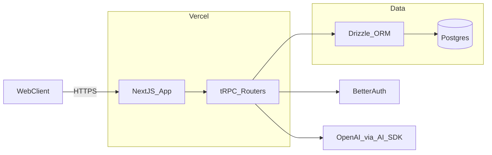

1. Overview

Recall is a web application for learning through spaced recall, interleaving, and elaboration. Users can sign up/sign in, create notebooks, inside of which they can create notes, and initiate quizzes to test knowledge. Initial quiz scaffolding is included; the detailed quiz system design will be refined collaboratively at a later date.

- Tech stack: Next.js (App Router), tRPC, Drizzle ORM (Postgres), BetterAuth, Zod, shadcn/ui, Vercel OpenAI API via AI SDK 5.
- Hosting: Vercel (app) + Postgres (e.g., Neon/Timescale/Managed Postgres).
- Philosophy (to inform later quiz design): spaced recall with exponential falloff, interleaving across categories, and escalating elaboration depth.

2. Architecture Diagram



3. Configuration

Expressed as YAML for clarity; environment values come from `.env`.

```yaml
app:
  name: Recall
  url: ${NEXT_PUBLIC_APP_URL}
  env: ${NODE_ENV}

database:
  provider: postgres
  url: ${DATABASE_URL}

auth:
  provider: betterauth
  session:
    strategy: jwt
  secret: ${BETTER_AUTH_SECRET}

openai:
  provider: openai
  model: gpt-5
  baseURL: https://api.openai.com/v1
  apiKey: ${OPENAI_API_KEY}
  serviceTier: auto
  parallelToolCalls: true

logging:
  level: info
  healthEndpoint: /api/health

ui:
  theme: shadcn
```

Environment variables

Name                	Type    	Default               	Description
DATABASE_URL        	string  	—                     	Postgres connection string
OPENAI_API_KEY      	string  	—                     	API key for OpenAI
BETTER_AUTH_SECRET  	string  	—                     	Secret for BetterAuth JWT/cookies
NEXT_PUBLIC_APP_URL 	string  	http://localhost:3000 	Public base URL for the app
NODE_ENV            	string  	development           	Node environment

4. API / Protocol

- Protocol: tRPC over HTTPS from Next.js server to client.
- Validation: Zod schemas for all inputs/outputs.
- Auth: BetterAuth-protected procedures; public procedures only for sign-in/up flows.

Routers and core procedures (initial):

- authRouter
  - signUp(input: { email, password }): { user }
  - signIn(input: { email, password }): { user }
  - getSession(): { user | null }

- notesRouter
  - create(input: { notebookId, text, categoryIds?[] }): { note }
  - update(input: { id, text?, categoryIds?[] }): { note }
  - list(input: { notebookId?, cursor?, limit? }): { notes, nextCursor? }
  - byId(input: { id }): { note }
  - delete(input: { id }): { success }

- notebooksRouter
  - create(input: { name, description? }): { notebook }
  - update(input: { id, name?, description? }): { notebook }
  - list(input: { cursor?, limit? }): { notebooks, nextCursor? }
  - byId(input: { id }): { notebook, notes[] }
  - delete(input: { id }): { success }

- categoriesRouter (user-defined, per-notebook)
  - create(input: { notebookId, name }): { category }
  - list(input: { notebookId }): { categories }
  - assignToNote(input: { noteId, categoryId }): { success } // must share notebook
  - removeFromNote(input: { noteId, categoryId }): { success }

- questionsRouter
  - findOrCreate(input: { noteId, desiredDifficulty?: number /* 0-1 */, minLastAskedSeconds?: number, timeCalled: string /* ISO timestamp */ }): { question }
  - byNote(input: { noteId }): { questions: Question[] }
  - regenerate(input: { noteId, style?: 'short' | 'long', timeCalled: string /* ISO timestamp */ }): { question }

- quizzesRouter (scaffold only; logic TBD)
  - create(input: { notebookId, categoryIds?[], createdAt?: string /* ISO timestamp */ }): { quiz }
  - get(input: { id }): { quiz, answers[] }
  - list(input: { notebookId, cursor?, limit? }): { quizzes, nextCursor? }
  - finalize(input: { id, score?, analysis?, finishedAt: string /* ISO timestamp */ }): { quiz } // sets finishedAt

- answersRouter
  - record(input: { quizId, noteId, questionId, correct, confidence?: number /* 0-1 */, difficulty?: number /* 0-1 */, answeredAt: string /* ISO timestamp */ }): { answer } // updates questions.last_asked_at = answeredAt
  - byQuiz(input: { quizId }): { answers[] }

OpenAI usage via AI SDK 5 (responses API by default). Reference: `@ai-sdk/openai` provider and `generateText`/`streamText` for future elaboration prompts and analysis. See provider docs for configuration such as `serviceTier`, `parallelToolCalls`, and `reasoningEffort`.

Pages and routes (App Router):

- `/sign-in` – Sign in page
- `/sign-up` – Sign up page
- `/` – Home with table of notebooks
- `/notebooks` – Notebook list (alias of home table)
- `/notebooks/[notebookId]` – Notebook detail with notes table and create form
- `/notebooks/[notebookId]/quizzes` – Quiz history for the notebook
- `/notebooks/[notebookId]/quizzes/[quizId]` – Active quiz if unfinished; results/analysis if finished (based on `finishedAt`)

Chosen route model (nested under notebook)

 - Pros: clear scoping; easy auth/ownership; filters naturally; good URL semantics
 - Cons: cross-notebook navigation slightly longer; no global quizzes index (optional future)
 - Structure example:
   - `app/notebooks/[notebookId]/page.tsx`
   - `app/notebooks/[notebookId]/quizzes/page.tsx`
   - `app/notebooks/[notebookId]/quizzes/[quizId]/page.tsx`

5. Phases & Tasks

### Phase 1: Project Scaffolding
- [x] Initialize Next.js (App Router) with TypeScript
- [x] Configure tRPC server and client helpers
- [x] Add Zod and base lint/format configs
- [x] Install shadcn/ui and set up theme
- [x] Set up Drizzle with Postgres connection
- [x] Add BetterAuth base configuration
- [x] Add AI SDK and OpenAI provider wiring
- [x] Add health check endpoint `/api/health`

### Phase 2: Authentication
- [x] Configure BetterAuth providers (email/password initially)
- [x] Implement sign in page
- [x] Implement sign up page
- [x] Protect app routes with server-side auth checks
- [x] Expose `getSession` in tRPC
- [x] Add basic account/profile menu in navbar
- [x] Add sign out

### Phase 3: Database Schema & Migrations
- [ ] Define naming conventions (plural snake_case tables; snake_case columns)
- [ ] Create tables: users (BetterAuth), notes, notebooks, answers, quizzes
- [ ] Create tables: categories, note_categories (many-to-many)
- [ ] Create table: notebook_notes (many-to-many)
- [ ] Add indexes and FKs (user ownership, created_at ordering)
- [ ] Generate and run Drizzle migrations
- [ ] Seed script for local dev data
- [ ] Add ERD export to docs

### Phase 4: Notes & Notebooks CRUD
- [ ] Implement `notebooksRouter` CRUD and pagination
- [ ] Implement `notesRouter` CRUD with category assignment
- [ ] Build Home page with notebooks table
- [ ] Build Notebook page with notes list and creation form
- [ ] Add categories management UI (create/assign/remove)
- [ ] Add optimistic updates and toasts
- [ ] Add access control (owner-only)
- [ ] Add unit/integration tests for routers

### Phase 5: Quiz Scaffolding (logic TBD)
- [ ] Create quiz entity and list/detail pages
- [ ] Implement `quizzesRouter` scaffold (create/get/list/finalize)
- [ ] Implement `answersRouter` record/byQuiz
- [ ] Wire minimal UI to start quiz from notebook/category selection
- [ ] Persist answers and basic score display
- [ ] Add basic analytics placeholder (per-quiz summary)
- [ ] Add guards for ownership/access
- [ ] Capture open questions for quiz logic iteration

### Phase 6: UI Polish & UX
- [ ] Global layout, navbar, breadcrumb
- [ ] Table components (shadcn DataTable) for notebooks/quizzes
- [ ] Forms with zod + react-hook-form
- [ ] Empty states, loading, error boundaries
- [ ] Keyboard shortcuts for note creation/navigation
- [ ] Responsive styles and theming
- [ ] A11y pass (ARIA, focus states)
- [ ] Copy and microinteractions

### Phase 7: Deployment & Ops
- [ ] Configure Vercel project and env vars
- [ ] Provision managed Postgres and connect
- [ ] Add observability (logs/metrics)
- [ ] Set up backups and DR plan
- [ ] Enable CI checks (lint, type, tests)
- [ ] Add runtime health and readiness checks
- [ ] Load test critical endpoints
- [ ] Cut v1 release

6. Testing Strategy

- Unit: Zod schemas and utility functions.
- Integration: tRPC procedures (authz, validation, data access with test DB).
- E2E: Playwright or Cypress user flows (auth, CRUD, quiz scaffold).
- Regression: Snapshot tests for critical UI components.
- Performance: Simple RUM timings for core interactions.

7. Monitoring & Metrics

- Logging: structured server logs (request id, user id, latency, status).
- Metrics: request latency and error rate per tRPC procedure; DB query timings.
- Usage: per-user note/quiz counts; OpenAI usage and latency.
- Tracing (optional): basic trace spans around quiz creation and answer recording.

8. Deployment

- Platform: Vercel for Next.js; managed Postgres (e.g., Neon/Render).
- Environments: Preview for PRs; Staging; Production.
- Env management: Vercel env variables with protected secrets.
- Migrations: Drizzle migrations run on deploy (or via CI job).
- Rollback: previous deployment alias + migration rollback plan.

9. Success Criteria

- Auth flows (sign up/in/out) work reliably across environments.
- Users can create, view, update, delete notes and notebooks they own.
- Users can categorize notes; notes may be in zero or many categories.
- Users can start a quiz and record answers; quizzes list/detail render.
- Data model and naming conventions are consistent and enforced.
- CI green: lint, type-check, tests; deploys succeed to Vercel.
- Telemetry shows acceptable latency (<300ms p95 for CRUD) and low error rate.

References

- OpenAI Provider (AI SDK 5) configuration and usage: https://ai-sdk.dev/providers/ai-sdk-providers/openai
 
Appendix A: Database Conventions and Initial Schema (Drizzle)

- Conventions
  - Table names: plural snake_case (e.g., `notes`, `notebooks`). This is idiomatic for Postgres and Drizzle schemas and avoids quoting.
  - Column names: snake_case (e.g., `created_at`).
  - Primary keys: `id` as `uuid` default `gen_random_uuid()`.
  - Timestamps: `created_at` and `updated_at` (`timestamptz`), server-updated.
  - FKs: `*_id` columns with `ON DELETE CASCADE` where owned.
  - Ownership: `user_id` on user-owned rows; row-level access enforced in app layer.

- Core Tables (initial)
  - users (managed by BetterAuth; referenced by `user_id`)
  - notebooks: `id`, `user_id`, `name`, `description`, `created_at`, `updated_at`
  - notes: `id`, `user_id`, `notebook_id`, `text`, `created_at`, `updated_at`
  - categories: `id`, `user_id`, `notebook_id`, `name`, `created_at`, `updated_at`
  - note_categories (M2M): `note_id`, `category_id`, (PK: composite) // category and note must share notebook
  - quizzes: `id`, `user_id`, `notebook_id`, `created_at`, `finished_at? timestamptz`, `score? numeric`, `analysis? jsonb`
  - questions: `id`, `note_id`, `user_id`, `question_text`, `difficulty numeric` /* 0-1 */, `last_asked_at? timestamptz`, `created_at`, `updated_at`
  - answers: `id`, `quiz_id`, `note_id`, `question_id`, `user_id`, `correct boolean`, `confidence numeric?` /* 0-1 */, `difficulty numeric?` /* 0-1 */, `created_at`

- Indices
  - `notes(user_id, created_at desc)`
  - `notes(notebook_id, created_at desc)`
  - `notebooks(user_id, created_at desc)`
  - `categories(notebook_id)` and unique (`notebook_id`, lower(name))
  - `quizzes(user_id, created_at desc)`
  - `quizzes(notebook_id, created_at desc)`
  - `quizzes(notebook_id, finished_at nulls first, created_at desc)`
  - `answers(quiz_id)` and `answers(user_id, created_at desc)`
  - `answers(question_id, created_at desc)`
  - `note_categories(category_id)` and `note_categories(note_id)`

- Drizzle schema sketch (illustrative)

```sql
-- Postgres types
create extension if not exists pgcrypto;

create table users (
  id uuid primary key,
  email text unique not null
);

create table notebooks (
  id uuid primary key default gen_random_uuid(),
  user_id uuid not null references users(id) on delete cascade,
  name text not null,
  description text,
  created_at timestamptz not null default now(),
  updated_at timestamptz not null default now()
);

create table notes (
  id uuid primary key default gen_random_uuid(),
  user_id uuid not null references users(id) on delete cascade,
  notebook_id uuid not null references notebooks(id) on delete cascade,
  text text not null,
  created_at timestamptz not null default now(),
  updated_at timestamptz not null default now()
);

create table categories (
  id uuid primary key default gen_random_uuid(),
  user_id uuid not null references users(id) on delete cascade,
  notebook_id uuid not null references notebooks(id) on delete cascade,
  name text not null,
  created_at timestamptz not null default now(),
  updated_at timestamptz not null default now()
);
create unique index categories_notebook_name_idx on categories (notebook_id, lower(name));

create table note_categories (
  note_id uuid not null references notes(id) on delete cascade,
  category_id uuid not null references categories(id) on delete cascade,
  primary key (note_id, category_id)
);

create table quizzes (
  id uuid primary key default gen_random_uuid(),
  user_id uuid not null references users(id) on delete cascade,
  notebook_id uuid not null references notebooks(id) on delete cascade,
  created_at timestamptz not null default now(),
  finished_at timestamptz,
  score numeric,
  analysis jsonb
);

create table questions (
  id uuid primary key default gen_random_uuid(),
  note_id uuid not null references notes(id) on delete cascade,
  user_id uuid not null references users(id) on delete cascade,
  question_text text not null,
  difficulty numeric,
  last_asked_at timestamptz,
  created_at timestamptz not null default now(),
  updated_at timestamptz not null default now()
);

create table answers (
  id uuid primary key default gen_random_uuid(),
  quiz_id uuid not null references quizzes(id) on delete cascade,
  note_id uuid not null references notes(id) on delete cascade,
  question_id uuid not null references questions(id) on delete cascade,
  user_id uuid not null references users(id) on delete cascade,
  correct boolean not null,
  confidence numeric,
  difficulty numeric,
  created_at timestamptz not null default now()
);
create index answers_question_id_created_at_idx on answers (question_id, created_at desc);
```

